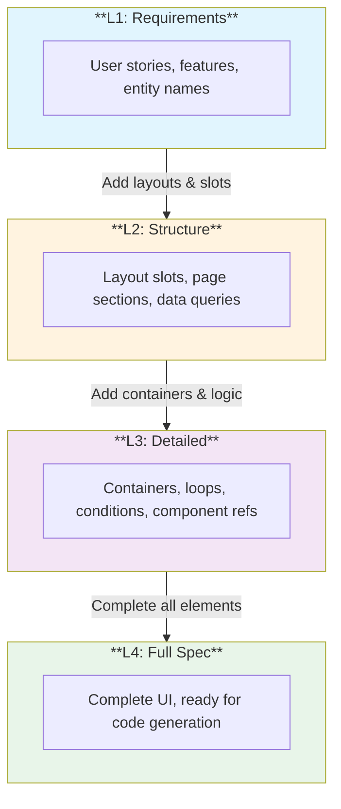
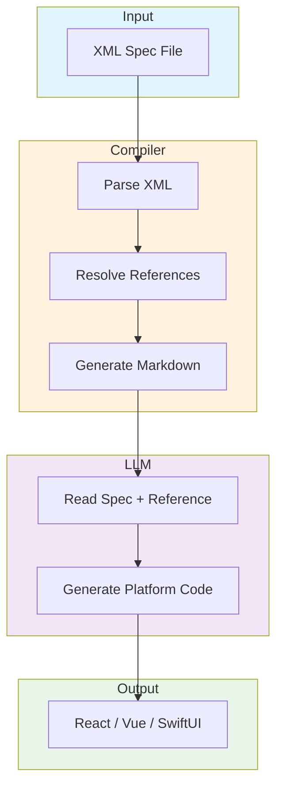

# LLM UI Spec

A declarative XML specification for defining UI structure that can be interpreted by LLMs to generate platform-specific code.

## Overview

LLM UI Spec allows you to define UI at varying levels of specificity:

- **Fully defined**: Explicit structure, components, and bindings
- **Prompt-guided**: Natural language descriptions for LLM interpretation
- **Hybrid**: Mix of defined structure with prompt-guided sections

## Why LLM UI Spec?

**Keep LLMs grounded.** Without a spec, LLMs make assumptions about your UI that drift from your intent. Each generation becomes harder to control.

LLM UI Spec provides:

| Benefit | Without Spec | With Spec |
|---------|--------------|-----------|
| **Consistency** | LLM invents new patterns each time | Follows your defined components and layouts |
| **Control** | "Make it look nice" → unpredictable | Explicit structure with creative prompts where needed |
| **Iteration** | Start over or fight hallucinations | Refine progressively from L1 → L4 |
| **Cross-platform** | Rewrite everything per platform | Shared entities, platform-specific UI |
| **Constraints** | Hope LLM follows best practices | Enforce with `Must` / `Must NOT` rules |

The spec is your **single source of truth**. LLMs reference it to generate consistent, predictable code while still having creative freedom where you allow it.

## Features

- **Visual Editor** - React-based editor for creating and editing specs with drag-and-drop
- **Spec Compiler** - Converts XML specs to LLM-friendly markdown for code generation
- **Iterative Workflow** - 4-level progressive refinement from requirements to full spec
- **External Files** - Split large specs into multiple files for better organization
- **Reference System** - Type-safe references between entities, components, pages, and more

## Quick Start

### Option 1: Visual Editor

```bash
cd editor && npm install && npm run dev
```

Open http://localhost:5173 to use the visual editor.

### Option 2: Write XML Directly

```xml
<?xml version="1.0" encoding="UTF-8"?>
<webapp name="MyApp" version="1.0" detail="full">
  <entities>
    <entity name="User">
      <field name="id" type="uuid" />
      <field name="name" type="string" required="true" />
    </entity>
  </entities>

  <pages>
    <!-- Well-defined page -->
    <page name="Dashboard" route="/dashboard">
      <container layout="column" gap="lg">
        <text variant="heading1">Welcome</text>
        <text value="@state.user.name" />
      </container>
    </page>

    <!-- Prompt-guided page -->
    <page name="Analytics" route="/analytics">
      <prompt>
        Create an analytics dashboard with charts showing
        user engagement, revenue trends, and geographic data.
      </prompt>
    </page>
  </pages>
</webapp>
```

### Option 3: Compile to Markdown

```bash
cd compiler && npm install && npm run build
node dist/cli.js ../samples/formcraft.spec.xml -o output.md
```

## Iterative Development

LLM UI Spec supports progressive refinement through 4 detail levels. Start with high-level requirements and iteratively add detail, validating at each step.



### Detail Levels

| Level | Attribute | Contains | Prompts For |
|-------|-----------|----------|-------------|
| L1 | `detail="requirements"` | Entities, page names, layout names | Entire pages and layouts |
| L2 | `detail="structure"` | Layout slots, page sections, data queries | Section-level UI |
| L3 | `detail="detailed"` | Containers, loops, conditions, component refs | Complex interactions, styling |
| L4 | `detail="full"` | Complete UI elements | None (or minimal) |

### Example: Same Page at Each Level

**L1 - Requirements:**
```xml
<page name="Dashboard" route="/dashboard" auth="required">
  <prompt>Main dashboard showing form count, submission stats, recent activity</prompt>
</page>
```

**L2 - Structure:**
```xml
<page name="Dashboard" route="/dashboard" layout="AppShell" auth="required">
  <data>
    <query name="stats" source="api/dashboard/stats" />
    <query name="recentForms" type="@entity.Form[]" limit="6" />
  </data>
  <slot target="@layout.AppShell.content">
    <prompt>Stats row: 4 cards showing total forms, submissions, completion rate</prompt>
    <prompt>Recent forms section: grid of FormCard components</prompt>
  </slot>
</page>
```

**L3 - Detailed:**
```xml
<page name="Dashboard" route="/dashboard" layout="AppShell" auth="required">
  <data>
    <query name="stats" source="api/dashboard/stats" />
    <query name="recentForms" type="@entity.Form[]" limit="6" />
  </data>
  <slot target="@layout.AppShell.content">
    <container layout="column" gap="xl">
      <container layout="grid" columns="4" gap="md">
        <use component="StatCard" label="Total Forms" value="@state.stats.totalForms" />
        <use component="StatCard" label="Submissions" value="@state.stats.submissions" />
      </container>
      <section>
        <heading level="2">Recent Forms</heading>
        <if condition="@state.recentForms.length > 0">
          <for each="form" in="@state.recentForms">
            <use component="FormCard" form="@item" />
          </for>
        </if>
        <else>
          <prompt>Empty state with illustration and "Create Form" button</prompt>
        </else>
      </section>
    </container>
  </slot>
</page>
```

### Why Iterative?

- **Validate early** - Review structure before investing in details
- **Faster feedback** - Each level can be reviewed independently
- **Flexible detail** - Keep some sections as prompts, fully specify others
- **LLM-assisted refinement** - Use LLMs to expand each level

See [samples/llm-workflow-guide.md](samples/llm-workflow-guide.md) for LLM prompts to guide each level transition.

## Reference Namespaces

All references use the `@` prefix:

| Namespace | Example | Description |
|-----------|---------|-------------|
| `@entity` | `@entity.User.name` | Entity schema |
| `@component` | `@component.UserCard` | Component definition |
| `@page` | `@page.Dashboard` | Page navigation |
| `@layout` | `@layout.AppShell.header` | Layout slot |
| `@prop` | `@prop.user.name` | Component prop |
| `@state` | `@state.currentUser` | Page state |
| `@param` | `@param.id` | URL parameter |
| `@item` | `@item.title` | Loop item |
| `@action` | `@action.save` | Defined action |
| `@theme` | `@theme.colors.primary` | Theme token |

## Project Structure

```
llm-ui-spec/
├── README.md              # This file
├── SPEC.md                # Full specification documentation
├── SPEC-REFERENCE.md      # Condensed reference for LLM prompts
├── schema.xsd             # XML Schema for validation
├── compiler/              # Spec-to-markdown compiler
│   ├── src/
│   │   ├── cli.ts         # CLI entry point
│   │   ├── parser.ts      # XML parser
│   │   ├── generator.ts   # Markdown generator
│   │   └── types.ts       # TypeScript types
│   └── package.json
├── editor/                # Visual spec editor
│   ├── src/
│   │   ├── components/    # React components
│   │   ├── store/         # Zustand state stores
│   │   ├── lib/           # XML parsing, DnD, utilities
│   │   └── types/         # TypeScript definitions
│   └── package.json
├── samples/
│   ├── formcraft.shared.spec.xml    # Shared entities & components
│   ├── formcraft.spec.xml           # Webapp (pages, modals)
│   ├── formcraft.mobile.spec.xml    # Mobile (screens, sheets, tabs)
│   ├── formcraft.desktop.spec.xml   # Desktop (windows, menus, toolbar)
│   ├── formcraft.entities.spec.xml  # External entities file
│   ├── formcraft.md                 # Compiled markdown output
│   ├── llm-workflow-guide.md        # Iterative development guide
│   └── llm-codegen-prompt.md        # Code generation prompt template
└── docs/                            # VitePress documentation site
```

## Sample Application

The `samples/` folder contains FormCraft, a complete cross-platform SaaS form builder:

| File | Description |
|------|-------------|
| `formcraft.shared.spec.xml` | Shared entities (User, Form, Submission) and components (Avatar, FormCard, StatCard) |
| `formcraft.spec.xml` | Webapp with pages, modals, sidebar navigation |
| `formcraft.mobile.spec.xml` | Mobile with screens, tabs, sheets, swipe actions |
| `formcraft.desktop.spec.xml` | Desktop with windows, menu bar, toolbar, context menus |

**Features demonstrated:**
- **Cross-platform**: Same entities/components, platform-specific UI patterns
- **Detail levels**: Mix of fully-defined and prompt-guided sections
- **Reusable components**: Avatar, FormCard, StatCard, EmptyState
- **Entity relationships**: User → Forms → Submissions

## External File Support

Large specs can be split into multiple files:

```xml
<!-- Main spec file -->
<webapp name="MyApp">
  <entities src="./myapp.entities.spec.xml" />
  <layouts src="./myapp.layouts.spec.xml" />
  <!-- ... -->
</webapp>

<!-- External file (myapp.entities.spec.xml) -->
<spec type="entities" webapp="MyApp">
  <entity name="User">...</entity>
</spec>
```

## Using with LLMs

### Including the Spec Reference

For best results, include **SPEC-REFERENCE.md** in your LLM prompts:

```
Use the LLM UI Spec format as defined in the attached SPEC-REFERENCE.md file.
```

### Generation Flow



### Code Generation Prompt

See [samples/llm-codegen-prompt.md](samples/llm-codegen-prompt.md) for a complete prompt template that includes:

- Framework and styling preferences
- Accessibility requirements
- State handling patterns
- Component generation rules

## Key Concepts

### Entities

Data models that components bind to:

```xml
<entity name="Task">
  <field name="title" type="string" required="true" />
  <field name="status" type="enum" values="todo,in_progress,done" />
  <field name="assignee" type="ref" ref="@entity.User" />
</entity>
```

### Layouts

Page structure with named slots:

```xml
<layout name="AppShell">
  <container layout="column" minHeight="100vh">
    <slot name="header" height="64px" role="chrome" />
    <container layout="row" grow="true">
      <slot name="sidebar" width="240px" role="chrome" />
      <slot name="content" grow="true" role="content" />
    </container>
  </container>
</layout>
```

### Components

Reusable UI pieces with props and actions:

```xml
<component name="TaskCard">
  <props>
    <prop name="task" type="@entity.Task" required="true" />
  </props>
  <actions>
    <action name="onComplete" />
  </actions>
  <container layout="row" padding="md">
    <text value="@prop.task.title" />
    <badge value="@prop.task.status" />
  </container>
</component>
```

### Pages

Routes with data queries and slot assignments:

```xml
<page name="Dashboard" route="/dashboard" layout="AppShell" auth="required">
  <data>
    <query name="tasks" type="@entity.Task[]" filter="assignee == @auth.user" />
  </data>

  <slot target="@layout.AppShell.content">
    <for each="task" in="@state.tasks">
      <use component="TaskCard" task="@item" />
    </for>
  </slot>
</page>
```

### Prompts

Natural language guidance at any level:

```xml
<!-- Page-level prompt (L1) -->
<page name="Dashboard">
  <prompt>Create a dashboard with stats and charts</prompt>
</page>

<!-- Section-level prompt (L2) -->
<slot target="@layout.AppShell.content">
  <prompt>Grid of 4 analytics charts showing key metrics</prompt>
</slot>

<!-- Element-level prompt with constraints (L3) -->
<prompt constraints="true">
  Empty state illustration with "No tasks yet" message.
  YOU MUST include a "Create Task" button.
</prompt>
```

## Documentation

- **[SPEC.md](SPEC.md)** - Full specification with all elements and attributes
- **[SPEC-REFERENCE.md](SPEC-REFERENCE.md)** - Condensed reference for LLM prompts
- **[samples/llm-workflow-guide.md](samples/llm-workflow-guide.md)** - Iterative development workflow

## License

MIT
