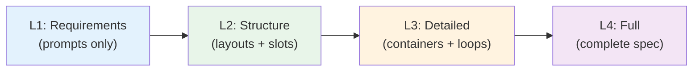

## Why LLM UI Spec?

**Keep LLMs grounded.** Without a spec, LLMs make assumptions about your UI that drift from your intent. Each generation becomes harder to control.

| Benefit | Without Spec | With Spec |
|---------|--------------|-----------|
| **Consistency** | LLM invents new patterns each time | Follows your defined components and layouts |
| **Control** | "Make it look nice" → unpredictable | Explicit structure with creative prompts where needed |
| **Iteration** | Start over or fight hallucinations | Refine progressively from L1 → L4 |
| **Cross-platform** | Rewrite everything per platform | Shared entities, platform-specific UI |
| **Constraints** | Hope LLM follows best practices | Enforce with `Must` / `Must NOT` rules |

The spec is your **single source of truth**. LLMs reference it to generate consistent, predictable code while still having creative freedom where you allow it.

## Iterative Development

Start with high-level requirements, progressively add detail:



At each level, validate with stakeholders before adding more detail. Generate code at any level - LLMs fill in the gaps based on your prompts and constraints.

## Quick Example

```xml
<webapp name="MyApp" version="1.0">
  <entities>
    <entity name="Task">
      <field name="id" type="uuid" />
      <field name="title" type="string" required="true" />
      <field name="completed" type="boolean" default="false" />
    </entity>
  </entities>

  <pages>
    <page name="Dashboard" route="/dashboard">
      <prompt>
        Task dashboard with filterable list and quick-add form.
        Show completion stats at the top.
      </prompt>
    </page>
  </pages>
</webapp>
```

## Platforms

<div class="platforms">

### Webapp
Layouts, pages, modals, sidebar navigation, tables with pagination.

[Learn more →](/spec/webapp)

### Mobile
Screens, tab navigation, bottom sheets, swipe actions, pull-to-refresh.

[Learn more →](/spec/mobile)

### Desktop
Windows, menu bar, toolbar, context menus, split views, keyboard shortcuts.

[Learn more →](/spec/desktop)

</div>

<style>
.platforms {
  display: grid;
  grid-template-columns: repeat(3, 1fr);
  gap: 1.5rem;
  margin-top: 2rem;
}

@media (max-width: 768px) {
  .platforms {
    grid-template-columns: 1fr;
  }
}

.platforms h3 {
  margin-top: 0;
}
</style>
