# Platform Element Mapping

Visual reference for converting specs between webapp, mobile, and desktop platforms.

---

## Migration Prompts

Sample prompts for converting specs between platforms using an LLM. Each prompt references the target platform specification for schema validation.

### Webapp → Mobile

```text
Convert this webapp spec to a mobile spec.

IMPORTANT:
- You MUST validate the output against the target platform schema.
- Only use elements, attributes, and patterns defined in the specification.
- If you encounter elements or patterns that cannot be converted, add a comment
  "<!-- ERROR: [source_file:line_number] [description of incompatibility] -->"
  so the user can locate and address it.

Reference the Mobile Platform Specification at:
https://llm-ui-spec.org/llm-ui-spec/spec/mobile

For shared concepts (entities, components, prompts), reference:
https://llm-ui-spec.org/llm-ui-spec/spec/

Follow these conversion rules:

1. Navigation:
   - Replace sidebar/header navigation with tab bar navigation
   - Convert navItems to tabs with icons
   - Use push() for screen transitions instead of page links

2. Pages → Screens:
   - Rename <pages> to <screens> and <page> to <screen>
   - Add navigationBar with title and back button where needed
   - Add safeArea="true" to root containers

3. Overlays:
   - Convert <modal> to <sheet> with height="auto" and dismissible="true"
   - Replace openModal/closeModal with presentSheet/dismissSheet
   - Add <floatingButton> for primary create actions

4. Lists:
   - Convert <table> to <list> with refreshable="true"
   - Replace dropdown menus with swipeActions
   - Add pull-to-refresh where appropriate

5. Inputs:
   - Add fullWidth="true" to primary action buttons
   - Use segmentedControl instead of horizontal tabs

Here is the webapp spec to convert:

[PASTE WEBAPP SPEC HERE]
```

### Webapp → Desktop

```text
Convert this webapp spec to a desktop spec.

IMPORTANT:
- You MUST validate the output against the target platform schema.
- Only use elements, attributes, and patterns defined in the specification.
- If you encounter elements or patterns that cannot be converted, add a comment
  "<!-- ERROR: [source_file:line_number] [description of incompatibility] -->"
  so the user can locate and address it.

Reference the Desktop Platform Specification at:
https://llm-ui-spec.org/llm-ui-spec/spec/desktop

For shared concepts (entities, components, prompts), reference:
https://llm-ui-spec.org/llm-ui-spec/spec/

Follow these conversion rules:

1. Add App Configuration:
   - Add <config> with window dimensions and title
   - Consider adding <tray> for background operation

2. Navigation:
   - Add <menuBar> with File, Edit, View, Help menus
   - Include keyboard shortcuts for common actions
   - Convert sidebar navigation to <treeView>
   - Replace page links with setView() calls

3. Pages → Views:
   - Rename <pages> to <views> and <page> to <view>
   - Wrap content in <splitView> for resizable panels

4. Add Toolbar:
   - Create <toolbar> with common action buttons
   - Include tooltips showing keyboard shortcuts

5. Overlays:
   - Convert <modal> to <dialog> with explicit width
   - Add Cancel/Confirm button row with proper alignment
   - Add autoFocus="true" to first input

6. Lists:
   - Add selectable="true" to tables
   - Add contextMenu for right-click actions
   - Add onDoubleClick for quick edit

7. Add Status Bar:
   - Show item counts, save status, sync state

Here is the webapp spec to convert:

[PASTE WEBAPP SPEC HERE]
```

### Mobile → Webapp

```text
Convert this mobile spec to a webapp spec.

IMPORTANT:
- You MUST validate the output against the target platform schema.
- Only use elements, attributes, and patterns defined in the specification.
- If you encounter elements or patterns that cannot be converted, add a comment
  "<!-- ERROR: [source_file:line_number] [description of incompatibility] -->"
  so the user can locate and address it.

Reference the Webapp Platform Specification at:
https://llm-ui-spec.org/llm-ui-spec/spec/webapp

For shared concepts (entities, components, prompts), reference:
https://llm-ui-spec.org/llm-ui-spec/spec/

Follow these conversion rules:

1. Navigation:
   - Replace tab navigation with sidebar layout
   - Convert tabs to navItems in sidebar slot
   - Replace push/pop with page links

2. Screens → Pages:
   - Rename <screens> to <pages> and <screen> to <page>
   - Remove navigationBar (use layout header instead)
   - Remove safeArea attributes

3. Overlays:
   - Convert <sheet> to <modal>
   - Replace presentSheet/dismissSheet with openModal/closeModal
   - Replace floatingButton with regular button

4. Lists:
   - Convert <list> to <table> with columns
   - Replace swipeActions with dropdown menu
   - Add <pagination> for large datasets

5. Inputs:
   - Remove fullWidth from buttons (use layout instead)
   - Convert segmentedControl to horizontal tabs

Here is the mobile spec to convert:

[PASTE MOBILE SPEC HERE]
```

### Partial Migration (Single Component)

```text
I have this [COMPONENT TYPE] from a webapp spec:

[PASTE COMPONENT HERE]

Convert it to the [mobile/desktop] equivalent.

IMPORTANT:
- You MUST validate the output against the target platform schema.
- Only use elements, attributes, and patterns defined in the specification.
- If you encounter elements or patterns that cannot be converted, add a comment
  "<!-- ERROR: [source_file:line_number] [description of incompatibility] -->"
  so the user can locate and address it.

Reference the target platform specification:
- Mobile: https://llm-ui-spec.org/llm-ui-spec/spec/mobile
- Desktop: https://llm-ui-spec.org/llm-ui-spec/spec/desktop
- Core concepts: https://llm-ui-spec.org/llm-ui-spec/spec/

Requirements:
- Use appropriate navigation patterns for the target platform
- Apply platform-specific interaction patterns
- Maintain the same functionality and data bindings
```

---

## Quick Examples

### Navigation Example

**Webapp:**
```xml
<layout name="AppShell">
  <slot name="sidebar">
    <navItem to="@page.Dashboard">Dashboard</navItem>
    <navItem to="@page.Forms">Forms</navItem>
  </slot>
</layout>
```

**Mobile:**
```xml
<navigation type="tabs">
  <tab label="Dashboard" screen="@screen.Dashboard" />
  <tab label="Forms" screen="@screen.Forms" />
</navigation>
```

**Desktop:**
```xml
<treeView>
  <treeItem label="Dashboard" onClick="@action.setView('dashboard')" />
  <treeItem label="Forms" expanded="true">
    <for each="form" in="@state.forms">
      <treeItem label="@item.name" onClick="@action.selectForm(@item.id)" />
    </for>
  </treeItem>
</treeView>
```

### Dialog Example

**Webapp:**
```xml
<modal name="Create" title="New Item">
  <form onSubmit="@action.create" onSuccess="closeModal()">
    <input label="Name" bind="name" />
    <button type="submit">Create</button>
  </form>
</modal>

<button onClick="openModal(@modal.Create)">New</button>
```

**Mobile:**
```xml
<sheet name="Create" height="auto" dismissible="true">
  <form onSubmit="@action.create" onSuccess="dismissSheet()">
    <input label="Name" bind="name" />
    <button type="submit" fullWidth="true">Create</button>
  </form>
</sheet>

<floatingButton icon="plus" onClick="presentSheet(@sheet.Create)" />
```

**Desktop:**
```xml
<dialog name="Create" title="New Item" width="450">
  <form onSubmit="@action.create" onSuccess="closeDialog()">
    <input label="Name" bind="name" autoFocus="true" />
    <row justify="end" gap="sm">
      <button variant="outline" onClick="closeDialog()">Cancel</button>
      <button type="submit" variant="primary">Create</button>
    </row>
  </form>
</dialog>

<menuBar>
  <menu label="File">
    <menuItem label="New" shortcut="Ctrl+N" onClick="openDialog(@dialog.Create)" />
  </menu>
</menuBar>
```

### List Example

**Webapp:**
```xml
<table>
  <for each="item" in="@state.items">
    <tr>
      <td>@item.name</td>
      <td>
        <dropdown>
          <menuItem onClick="@action.edit">Edit</menuItem>
          <menuItem onClick="@action.delete">Delete</menuItem>
        </dropdown>
      </td>
    </tr>
  </for>
</table>
<pagination data="@state.items" />
```

**Mobile:**
```xml
<list data="@state.items" refreshable="true">
  <for each="item" in="@data">
    <listItem title="@item.name" swipeActions="true">
      <swipeAction icon="edit" onClick="@action.edit" />
      <swipeAction icon="trash" color="danger" onClick="@action.delete" />
    </listItem>
  </for>
</list>
```

**Desktop:**
```xml
<table selectable="true">
  <for each="item" in="@state.items">
    <tr contextMenu="@contextMenu.Item" onDoubleClick="@action.edit">
      <td>@item.name</td>
    </tr>
  </for>
</table>
<pagination data="@state.items" />

<contextMenu name="Item">
  <menuItem icon="edit" label="Edit" onClick="@action.edit" />
  <menuItem icon="trash" label="Delete" color="danger" onClick="@action.delete" />
</contextMenu>
```

---

## Element Mapping Diagrams

### Navigation


### Page Structure


### Overlays & Dialogs


### Lists & Data


### Forms & Inputs


### Actions & Buttons


### Typography


### Layout Containers


### Action Functions



### Platform-Specific Elements



---

## Migration Workflow Diagrams

### Webapp → Mobile



### Webapp → Desktop


