# Platform Element Mapping

Visual reference for converting webapp specs to mobile specs.

---

## Navigation

```mermaid
flowchart TB
    subgraph section[" "]
        direction LR
        subgraph Webapp["🌐 Webapp"]
            direction TB
            W1["**Primary Nav**<br/>layout + sidebar slot"]
            W2["**Nav Item**<br/>navItem to=@page.X"]
            W3["**Route**<br/>page route=/path"]
            W4["**Back**<br/>Browser history"]
        end
        subgraph Mobile["📱 Mobile"]
            direction TB
            M1["**Primary Nav**<br/>navigation type=tabs"]
            M2["**Nav Item**<br/>tab screen=@screen.X"]
            M3["**Route**<br/>screen name=X"]
            M4["**Back**<br/>navigationBar backButton"]
        end
    end

    W1 -.-> M1
    W2 -.-> M2
    W3 -.-> M3
    W4 -.-> M4

    style Webapp fill:#e3f2fd,stroke:#1976d2
    style Mobile fill:#f3e5f5,stroke:#7b1fa2
```



---

## Page Structure


---

## Overlays & Dialogs


---

## Lists & Data


---

## Forms & Inputs

```mermaid
flowchart TB
    subgraph section[" "]
        direction LR
        subgraph Webapp["🌐 Webapp"]
            direction TB
            W1["**Form**<br/>form"]
            W2["**Text**<br/>input"]
            W3["**Select**<br/>select"]
            W4["**Toggle**<br/>switch or checkbox"]
            W5["**Date**<br/>datepicker"]
            W6["**Choice**<br/>radio group"]
        end
        subgraph Mobile["📱 Mobile"]
            direction TB
            M1["**Form**<br/>form"]
            M2["**Text**<br/>input"]
            M3["**Select**<br/>select or picker sheet"]
            M4["**Toggle**<br/>switch"]
            M5["**Date**<br/>datepicker (native)"]
            M6["**Choice**<br/>segmentedControl"]
        end
    end

    W1 -.-> M1
    W2 -.-> M2
    W3 -.-> M3
    W4 -.-> M4
    W5 -.-> M5
    W6 -.-> M6

    style Webapp fill:#e3f2fd,stroke:#1976d2
    style Mobile fill:#f3e5f5,stroke:#7b1fa2
```



---

## Actions & Buttons

```mermaid
flowchart TB
    subgraph section[" "]
        direction LR
        subgraph Webapp["🌐 Webapp"]
            direction TB
            W1["**Primary Action**<br/>button in header"]
            W2["**Secondary**<br/>button group"]
            W3["**Destructive**<br/>button variant=danger"]
            W4["**Context Menu**<br/>dropdown / right-click"]
        end
        subgraph Mobile["📱 Mobile"]
            direction TB
            M1["**Primary Action**<br/>floatingButton or header"]
            M2["**Secondary**<br/>navigationBar rightButtons"]
            M3["**Destructive**<br/>alert destructive=true"]
            M4["**Context Menu**<br/>swipe or long-press"]
        end
    end

    W1 -.-> M1
    W2 -.-> M2
    W3 -.-> M3
    W4 -.-> M4

    style Webapp fill:#e3f2fd,stroke:#1976d2
    style Mobile fill:#f3e5f5,stroke:#7b1fa2
```



---

## Typography

```mermaid
flowchart TB
    subgraph section[" "]
        direction LR
        subgraph Webapp["🌐 Webapp"]
            direction TB
            W1["**Page Title**<br/>heading1"]
            W2["**Section**<br/>heading2"]
            W3["**Subsection**<br/>heading3"]
            W4["**Card Title**<br/>subtitle"]
            W5["**Body**<br/>body"]
            W6["**Secondary**<br/>caption"]
        end
        subgraph Mobile["📱 Mobile"]
            direction TB
            M1["**Page Title**<br/>largeTitle"]
            M2["**Section**<br/>title or headline"]
            M3["**Subsection**<br/>headline"]
            M4["**Card Title**<br/>body weight=medium"]
            M5["**Body**<br/>body"]
            M6["**Secondary**<br/>caption"]
        end
    end

    W1 -.-> M1
    W2 -.-> M2
    W3 -.-> M3
    W4 -.-> M4
    W5 -.-> M5
    W6 -.-> M6

    style Webapp fill:#e3f2fd,stroke:#1976d2
    style Mobile fill:#f3e5f5,stroke:#7b1fa2
```



---

## Layout Containers

```mermaid
flowchart TB
    subgraph section[" "]
        direction LR
        subgraph Webapp["🌐 Webapp"]
            direction TB
            W1["**Vertical**<br/>container layout=column"]
            W2["**Horizontal**<br/>container layout=row"]
            W3["**Grid**<br/>container layout=grid"]
            W4["**Card**<br/>container variant=card"]
            W5["**Section**<br/>section"]
        end
        subgraph Mobile["📱 Mobile"]
            direction TB
            M1["**Vertical**<br/>column"]
            M2["**Horizontal**<br/>row"]
            M3["**Grid**<br/>grid or list"]
            M4["**Card**<br/>container variant=card"]
            M5["**Section**<br/>listSection"]
        end
    end

    W1 -.-> M1
    W2 -.-> M2
    W3 -.-> M3
    W4 -.-> M4
    W5 -.-> M5

    style Webapp fill:#e3f2fd,stroke:#1976d2
    style Mobile fill:#f3e5f5,stroke:#7b1fa2
```



---

## Action Functions

```mermaid
flowchart TB
    subgraph section[" "]
        direction LR
        subgraph Webapp["🌐 Webapp"]
            direction TB
            W1["navigateTo(@page.X)"]
            W2["navigateBack( )"]
            W3["openModal(@modal.X)"]
            W4["closeModal( )"]
            W5["N/A"]
        end
        subgraph Mobile["📱 Mobile"]
            direction TB
            M1["push(@screen.X)"]
            M2["back button / swipe"]
            M3["presentSheet(@sheet.X)"]
            M4["dismissSheet( )"]
            M5["switchTab('name')"]
        end
    end

    W1 -.-> M1
    W2 -.-> M2
    W3 -.-> M3
    W4 -.-> M4
    W5 -.-> M5

    style Webapp fill:#e3f2fd,stroke:#1976d2
    style Mobile fill:#f3e5f5,stroke:#7b1fa2
```



---

## Platform-Specific Elements


---

## Migration Workflow

```mermaid
flowchart LR
    subgraph S1["1️⃣ Structure"]
        A1["page → screen"]
        A2["Add navigationBar"]
        A3["Add safeArea"]
    end

    subgraph S2["2️⃣ Navigation"]
        B1["sidebar → tabs"]
        B2["navigateTo → push"]
    end

    subgraph S3["3️⃣ Overlays"]
        C1["modal → sheet"]
        C2["confirm → alert"]
    end

    subgraph S4["4️⃣ Lists"]
        D1["table → list"]
        D2["Add refreshable"]
        D3["Add swipeActions"]
    end

    subgraph S5["5️⃣ Actions"]
        E1["button → FAB"]
    end

    S1 --> S2 --> S3 --> S4 --> S5

    style S1 fill:#e8f5e9,stroke:#388e3c
    style S2 fill:#e3f2fd,stroke:#1976d2
    style S3 fill:#fff3e0,stroke:#f57c00
    style S4 fill:#fce4ec,stroke:#c2185b
    style S5 fill:#f3e5f5,stroke:#7b1fa2
```



---

## Quick Examples

### Navigation Example

**Webapp:**
```xml
<layout name="AppShell">
  <slot name="sidebar">
    <navItem to="@page.Dashboard">Dashboard</navItem>
    <navItem to="@page.Forms">Forms</navItem>
  </slot>
</layout>
```

**Mobile:**
```xml
<navigation type="tabs">
  <tab label="Dashboard" screen="@screen.Dashboard" />
  <tab label="Forms" screen="@screen.Forms" />
</navigation>
```

### Dialog Example

**Webapp:**
```xml
<modal name="Create" title="New Item">
  <form onSubmit="@action.create" onSuccess="closeModal()">
    <input label="Name" bind="name" />
    <button type="submit">Create</button>
  </form>
</modal>

<button onClick="openModal(@modal.Create)">New</button>
```

**Mobile:**
```xml
<sheet name="Create" height="auto" dismissible="true">
  <form onSubmit="@action.create" onSuccess="dismissSheet()">
    <input label="Name" bind="name" />
    <button type="submit" fullWidth="true">Create</button>
  </form>
</sheet>

<floatingButton icon="plus" onClick="presentSheet(@sheet.Create)" />
```

### List Example

**Webapp:**
```xml
<table>
  <for each="item" in="@state.items">
    <tr>
      <td>@item.name</td>
      <td>
        <dropdown>
          <menuItem onClick="@action.edit">Edit</menuItem>
          <menuItem onClick="@action.delete">Delete</menuItem>
        </dropdown>
      </td>
    </tr>
  </for>
</table>
<pagination data="@state.items" />
```

**Mobile:**
```xml
<list data="@state.items" refreshable="true">
  <for each="item" in="@data">
    <listItem title="@item.name" swipeActions="true">
      <swipeAction icon="edit" onClick="@action.edit" />
      <swipeAction icon="trash" color="danger" onClick="@action.delete" />
    </listItem>
  </for>
</list>
```
