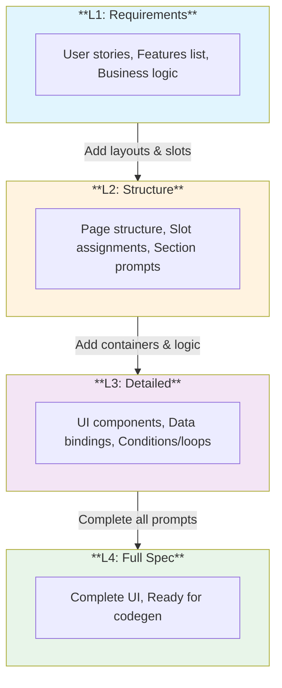

# LLM UI Spec: Iterative Development Workflow

This guide outlines a 4-level iterative approach to developing UI specifications with LLM assistance. Each level adds more detail, allowing you to refine and validate before committing to implementation details.

---

## Before You Start

For best results, include the **SPEC-REFERENCE.md** file in your LLM prompts. This gives the LLM the complete element and attribute reference.

**Option A: Include directly in prompt**
```
## UI Spec Reference
[PASTE CONTENTS OF SPEC-REFERENCE.md HERE]
```

**Option B: Reference as context (Claude, etc.)**
```
Use the LLM UI Spec format as defined in the attached SPEC-REFERENCE.md file.
```

---

## Workflow Overview



---

## Level 1: Requirements → High-Level Spec

**Goal:** Transform user requirements into a basic spec structure with prompts.

### Prompt Template

```
You are a UI/UX architect. I need you to create a Level 1 UI Spec from the following requirements.

## Requirements
[PASTE YOUR REQUIREMENTS HERE]

## Output Format
Create an XML spec following this structure:
- Use <webapp> as root with name and version
- Define <entities> with field names and types (no validation rules yet)
- Define <layouts> with just names and a <prompt> describing the layout
- Define <pages> with name, route, auth, and a <prompt> describing the page purpose
- Define <components> with just names and a <prompt> describing reusable elements

Keep everything at prompt-level - no containers, slots, or UI elements yet.

## Example Output Structure
```xml
<?xml version="1.0" encoding="UTF-8"?>
<webapp name="AppName" version="1.0" detail="requirements">
  <entities>
    <entity name="User">
      <field name="id" type="uuid" />
      <field name="email" type="email" />
      <field name="name" type="string" />
    </entity>
  </entities>

  <layouts>
    <layout name="AppShell">
      <prompt>Main application layout with header, sidebar, and content area</prompt>
    </layout>
  </layouts>

  <pages>
    <page name="Dashboard" route="/dashboard" auth="required">
      <prompt>Main dashboard showing key metrics and recent activity</prompt>
    </page>
  </pages>

  <components>
    <component name="StatCard">
      <prompt>Reusable card displaying a metric with label, value, and optional trend</prompt>
    </component>
  </components>
</webapp>
```

Now create the Level 1 spec:
```

### Example Input

```
I need a SaaS form builder application called "FormCraft" where users can:
- Create and manage forms with drag-and-drop
- Collect submissions and view analytics
- Integrate with webhooks and APIs
- Manage their subscription and billing

Users should be able to sign up, log in, and have different plans (free, pro, enterprise).
Forms can be published with a public URL.
```

### Example Output (L1)

```xml
<?xml version="1.0" encoding="UTF-8"?>
<webapp name="FormCraft" version="1.0" detail="requirements">
  <entities>
    <entity name="User">
      <field name="id" type="uuid" />
      <field name="email" type="email" />
      <field name="name" type="string" />
      <field name="plan" type="enum" values="free,pro,enterprise" />
    </entity>
    <entity name="Form">
      <field name="id" type="uuid" />
      <field name="name" type="string" />
      <field name="owner" type="ref" ref="@entity.User" />
      <field name="status" type="enum" values="draft,published" />
    </entity>
    <entity name="Submission">
      <field name="id" type="uuid" />
      <field name="form" type="ref" ref="@entity.Form" />
      <field name="data" type="json" />
    </entity>
  </entities>

  <layouts>
    <layout name="AppShell">
      <prompt>Main app layout with top header, left sidebar navigation, and main content area</prompt>
    </layout>
    <layout name="AuthLayout">
      <prompt>Split layout for auth pages - branding on left, form on right</prompt>
    </layout>
    <layout name="FormEditorLayout">
      <prompt>Three-column layout for form editor - field palette, canvas, properties panel</prompt>
    </layout>
  </layouts>

  <pages>
    <page name="Dashboard" route="/dashboard" auth="required">
      <prompt>Main dashboard showing form count, submission stats, recent activity</prompt>
    </page>
    <page name="FormEditor" route="/forms/:id/edit" auth="required">
      <prompt>Drag-and-drop form builder with live preview</prompt>
    </page>
    <page name="Submissions" route="/forms/:id/submissions" auth="required">
      <prompt>Table of form submissions with filtering, export options</prompt>
    </page>
    <page name="Analytics" route="/analytics" auth="required">
      <prompt>Charts and metrics for form performance</prompt>
    </page>
    <page name="Settings" route="/settings" auth="required">
      <prompt>User profile, API keys, notification preferences</prompt>
    </page>
    <page name="Billing" route="/billing" auth="required">
      <prompt>Subscription management, invoices, plan upgrade</prompt>
    </page>
    <page name="Login" route="/login" auth="guest">
      <prompt>Login form with email/password and social options</prompt>
    </page>
    <page name="Register" route="/register" auth="guest">
      <prompt>Registration form with plan selection</prompt>
    </page>
    <page name="PublicForm" route="/f/:slug" auth="none">
      <prompt>Public form view for respondents</prompt>
    </page>
  </pages>

  <components>
    <component name="StatCard">
      <prompt>Metric card with icon, label, value, and trend indicator</prompt>
    </component>
    <component name="FormCard">
      <prompt>Form preview card with name, status, submission count, actions menu</prompt>
    </component>
  </components>
</webapp>
```

---

## Level 2: Structure Refinement

**Goal:** Add layout structure, slot assignments, and break prompts into sections.

### Prompt Template

```
You are a UI/UX architect. I need you to refine this Level 1 spec to Level 2 by adding structure.

## Current Level 1 Spec
[PASTE L1 SPEC HERE]

## Your Task
1. Define layout structures with <container> and <slot> elements
2. Assign pages to layouts and fill slots
3. Break page prompts into section-level prompts
4. Add slot roles (chrome vs content)
5. Keep detailed UI as prompts - don't add specific elements yet

## Output Guidelines
- Layouts should define containers with layout="row|column" and slots with names
- Pages should reference layouts and use <slot target="@layout.Name.slotName">
- Each slot should contain focused prompts for that section
- Add data queries at page level if data sources are clear

## Example Transformation

FROM (L1):
```xml
<page name="Dashboard" route="/dashboard" auth="required">
  <prompt>Main dashboard showing form count, submission stats, recent activity</prompt>
</page>
```

TO (L2):
```xml
<page name="Dashboard" route="/dashboard" layout="AppShell" auth="required">
  <data>
    <query name="stats" source="api/dashboard/stats" />
    <query name="recentForms" type="@entity.Form[]" filter="owner == @auth.user" limit="6" />
  </data>

  <slot target="@layout.AppShell.header">
    <prompt>App header with logo, navigation links, user avatar dropdown</prompt>
  </slot>

  <slot target="@layout.AppShell.sidebar">
    <prompt>Navigation menu: Dashboard, Forms, Submissions, Analytics, Integrations, Settings</prompt>
  </slot>

  <slot target="@layout.AppShell.content">
    <prompt>Welcome section with user greeting and "Create Form" button</prompt>
    <prompt>Stats row: 4 cards showing total forms, submissions, completion rate, active forms</prompt>
    <prompt>Recent forms section: grid of FormCard components</prompt>
    <prompt>Recent submissions section: table with form name, date, preview, status</prompt>
  </slot>
</page>
```

Now refine the entire spec to Level 2:
```

---

## Level 3: Detailed UI Structure

**Goal:** Add containers, loops, conditions, and component usage while keeping complex logic as prompts.

### Prompt Template

```
You are a UI developer. Refine this Level 2 spec to Level 3 by adding UI structure.

## Current Level 2 Spec
[PASTE L2 SPEC HERE]

## Your Task
1. Replace section prompts with actual UI containers and elements
2. Add <for> loops for lists/grids
3. Add <if> conditions for state-dependent UI
4. Use <use component="Name"> for defined components
5. Keep complex/creative UI as <prompt> elements
6. Add <states> for loading/error/empty states

## Output Guidelines
- Use <container layout="row|column|grid"> for structure
- Use <for each="item" in="@state.items"> for iteration
- Use <if condition="@state.value"> for conditionals
- Reference data with @state.queryName
- Keep prompts for: icons, specific styling, animations, complex interactions

## Example Transformation

FROM (L2):
```xml
<slot target="@layout.AppShell.content">
  <prompt>Stats row: 4 cards showing total forms, submissions, completion rate, active forms</prompt>
  <prompt>Recent forms section: grid of FormCard components</prompt>
</slot>
```

TO (L3):
```xml
<slot target="@layout.AppShell.content">
  <container layout="column" gap="xl">

    <!-- Stats Section -->
    <container layout="grid" columns="4" gap="md">
      <use component="StatCard" label="Total Forms" value="@state.stats.totalForms" icon="file-text" />
      <use component="StatCard" label="Submissions" value="@state.stats.submissions" icon="inbox" />
      <use component="StatCard" label="Completion Rate" value="@state.stats.completionRate" icon="percent" format="percent" />
      <use component="StatCard" label="Active Forms" value="@state.stats.activeForms" icon="activity" />
    </container>

    <!-- Recent Forms Section -->
    <section>
      <container layout="row" justify="between" align="center">
        <heading level="2">Recent Forms</heading>
        <link to="@page.FormList">View All</link>
      </container>

      <if condition="@state.recentForms.length > 0">
        <container layout="grid" columns="3" gap="md">
          <for each="form" in="@state.recentForms">
            <use component="FormCard" form="@item" />
          </for>
        </container>
      </if>
      <else>
        <prompt>Empty state: illustration, "No forms yet" message, Create Form button</prompt>
      </else>
    </section>

  </container>
</slot>
```

Now refine the entire spec to Level 3:
```

---

## Level 4: Full Specification

**Goal:** Complete all remaining prompts with actual UI elements.

### Prompt Template

```
You are a UI developer. Complete this Level 3 spec to Level 4 (full specification).

## Current Level 3 Spec
[PASTE L3 SPEC HERE]

## Your Task
1. Replace ALL remaining <prompt> elements with actual UI
2. Add specific props, variants, and styling hints
3. Define all component props and actions
4. Add form validation rules to entities
5. Complete navigation guards and flows
6. Add theme tokens if needed

## Output Guidelines
- No <prompt> elements should remain (or minimal for truly dynamic content)
- All components should have complete prop definitions
- All interactions should have handlers defined
- Include loading/error/empty states for all data-dependent sections

## Quality Checklist
- [ ] All pages have complete UI structure
- [ ] All components have props defined
- [ ] All forms have validation
- [ ] All lists have empty states
- [ ] All async operations have loading states
- [ ] Navigation flow is complete
- [ ] Auth guards are defined

Now complete the spec to Level 4:
```

---

## Validation Prompts

### Validate Spec Completeness

```
Review this UI Spec for completeness and consistency:

[PASTE SPEC HERE]

Check for:
1. Missing routes or dead-end navigation
2. Undefined component references
3. Missing data queries for displayed data
4. Inconsistent entity references
5. Missing auth guards on protected pages
6. Missing loading/error states
7. Accessibility concerns
8. Mobile responsiveness considerations

Provide a checklist of issues found and suggestions to fix them.
```

### Generate Missing Components

```
Based on this UI Spec, identify and generate any missing component definitions:

[PASTE SPEC HERE]

For each <use component="X"> reference, ensure there's a matching <component name="X"> definition.
Generate complete component specs for any that are missing.
```

---

## Quick Reference: Detail Levels

| Level | Attribute | Contains | Prompts For |
|-------|-----------|----------|-------------|
| L1 | `detail="requirements"` | Entities, page names, layout names | Entire pages, entire layouts |
| L2 | `detail="structure"` | Layout slots, page sections, data queries | Section-level UI |
| L3 | `detail="detailed"` | Containers, loops, conditions, component refs | Complex interactions, styling |
| L4 | `detail="full"` | Complete UI elements | None (or minimal) |

---

## Tips for Best Results

1. **Be specific in requirements** - The more detail in L1, the better L2-L4 will be
2. **Review each level** - Validate structure before adding detail
3. **Use consistent naming** - Entity, component, and page names should be clear
4. **Think mobile-first** - Consider responsive behavior at L2
5. **Define data early** - Data queries at L2 help structure L3
6. **Iterate within levels** - It's OK to refine L2 multiple times before L3

---

## Example: Complete Workflow

See the `formcraft.spec.xml` sample for a complete L4 specification that was developed using this workflow.

To generate the LLM-ready markdown from any spec:

```bash
node compiler/dist/cli.js your-app.spec.xml -o your-app.md
```

The generated markdown can then be used with the `llm-codegen-prompt.md` template to generate actual code.
